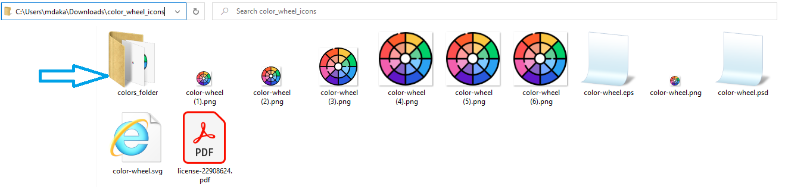

# Python rename images by width and height
    Select a folder path to rename images depends on width and height

## Example

## Usage

    [ python script_path prefix_icon_name dest_folder_name src_folder_path ]

    python              => command to run the script file
    script_path         => location to the python script, in our case in this package it is called main.py
    prefix_icon_name    => prefix name for each new generated files of type of image
    dest_folder_name    => the new destination folder name where you need the new images to be generated on
    src_folder_path     => the source folder path where are found the original icons that we need to copy the same file but with a different name
## Script

    python C:\python-rename-files\src\main.py prefix_icon_name new_folder_name src_folder_path
    

## Credits

- [Mohammad Daka](https://github.com/mdaka)
- [All Contributors](../../contributors)

## License

The MIT License (MIT). Please see [License File](LICENSE.md) for more information.